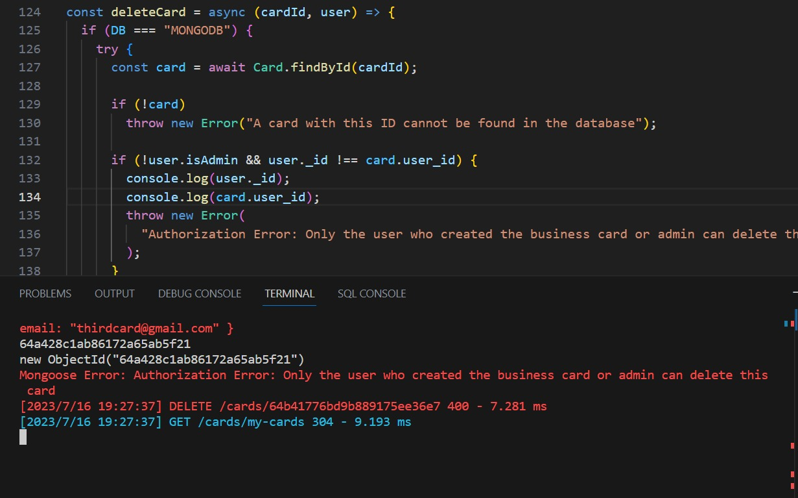

# Description:

- This is my React project in my studying in HackerU.
- This application represent the service where businesses
  can create their business cards and other users can see them and save in the favorites cards(if they signed up).
- For creating, editing and deleting cards you have to
  sign in as a business user.
- Admins can create, edit and delete all the cards and also have access to sandbox and CRM where he able to see
  all the users and change their type (business ot user).

# Server:

- The server for developing frontend was "bcard-typescript-demo"
  from https://github.com/David-Yakin/bcard-typescript-demo

- The function "deleteCard" in cardsAccessDataService.js file
  the line 132 of condition was changed to let the admin access
  for deleting card:

before:

```javascript
const deleteCard = async (cardId, user) => {
  if (DB === "MONGODB") {
    try {
      const card = await Card.findById(cardId);

      if (!card)
        throw new Error("A card with this ID cannot be found in the database");

      //the problem line:
      if (card.user_id != user._id)
        throw new Error(
          "Authorization Error: Only the user who created the business card or admin can delete this card"
        );

      const cardFromDB = await Card.findByIdAndDelete(cardId);
      return Promise.resolve(cardFromDB);
    } catch (error) {
      error.status = 400;
      return handleBadRequest("Mongoose", error);
    }
  }
  return Promise.resolve("card deleted not in mongodb");
};
```

after:

```Javascript
const deleteCard = async (cardId, user) => {
  if (DB === "MONGODB") {
    try {
      const card = await Card.findById(cardId);

      if (!card)
        throw new Error("A card with this ID cannot be found in the database");

      //fixed line:
      if (!user.isAdmin && user._id !== card.user_id)
        throw new Error(
          "Authorization Error: Only the user who created the business card or admin can delete this card"
        );

      const cardFromDB = await Card.findByIdAndDelete(cardId);
      return Promise.resolve(cardFromDB);
    } catch (error) {
      error.status = 400;
      return handleBadRequest("Mongoose", error);
    }
  }
  return Promise.resolve("card deleted not in mongodb");
};
```

- in deleting card there are some issue in the server side when the function deleteCard runs. Here you can see that key "user_id" of "card" is an object and mongo does not return a value:


